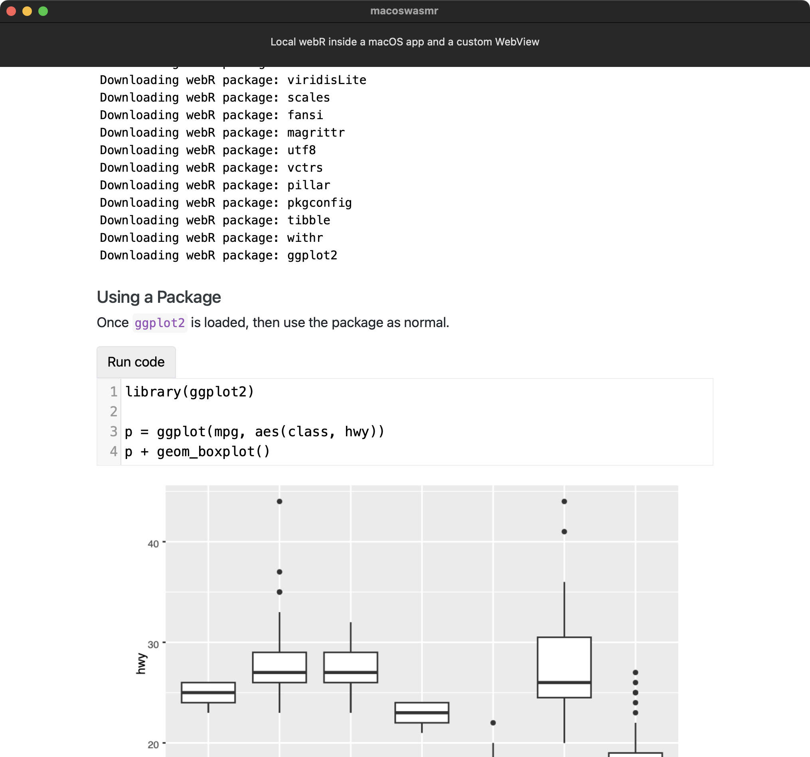

#  macoswasmr

What you see is my rendering of James' [quarto-webr](https://github.com/coatless/quarto-webr) demo document to a standalone HTML file (`webr/webr-demo.html`) and serving it via the local-to-app Swift Telegraph server and local WebR installation

- `webr/` is just the files from the official distribution and some test html (+ the demo app)
- `macoswasmrApp.swift` is just boilerplate SwitfUI 
- `ContentView.swift` should really be broken up into multiple files and contains the views, controller, and built-in Telegraph server initialization

## Installation

You can build this from source or check the GH releases for a notarized app zip.

## Addendum

- Forgive the name. This is a project I resurrected from last year (thanks to the burnout from the old job I never got around to getting this on GH).
- Minimal port to iOS working but it needs some work.
